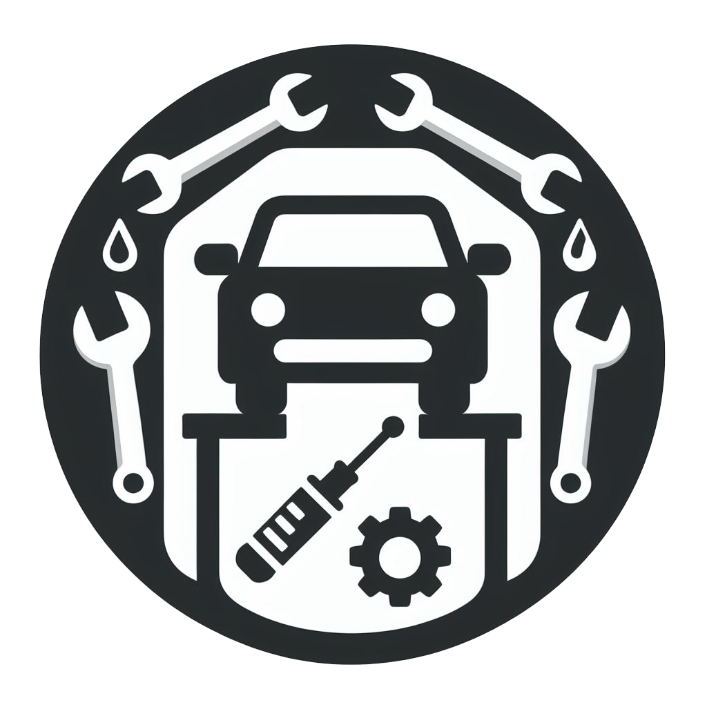

<!-- https://github.com/IRedDragonICY/car-repair-project -->

  

<h1>Car Repair Project</h1>

___

<!-- <!-- badge kotak besarnya sama collab -->
<!-- badge total bintang -->

<!-- visitor -->

This project is a collaboration between various teams with the following features:

| Team | Feature |
|------|---------|
| 1    | Vehicle Return Feature |
| 2    | Payment |
| 3    | Money Earnings Report |
| 4    | Car Description and Type |
| 5    | Help Center and Support |
| 6    | Management of Discounts and Promotions |
| 7    | Damage Report Feature |
| 8    | Reviews and Ratings |
| 9    | Driver Identity |
| 10   | Booking Feature |
| 11   | Additional Driver Option |
| 12   | Car Type Search |
| 13   | Rental Branch Option |

## Development Team

**Coordinator**: Pascalino Vincentius Belling Bahy Putra  
**Maintainer**: Mohammad Farid Hendianto - 2200018401

**Teaching Assistants**:  
1. Tiara Salsabila
2. Mahardiko Cesatista Rasendriya
3. Ananda Nur Rahmawa
4. Pascalino Vincentius B B Putra

**Created By**:  
- 2200018094	RENDIE ABDI SAPUTRA
- 2200018410	AISYAH SYAFI'I NURJANNAH
- 2200018004	MUHAMMAD GUSTIKA CHAFIDH 'ALIM
- 2200018189	AKYAS MUHAMMAD ZAIDAN
- 2000018157	BAGAS SAPUTRA
- 2200018432	MUHAMMAD 'IZZA MUBARAK
- 2200018433	DAFFA FACHREZY DHARMAWAN
- 2200018434	HAURA FAESA SYAHPUTRI ARINDI
- 2200018197	MUHAMAD FADHLI AKBAR
- 2200018183	ANDI BINTANG TOAR DONDOK
- 2200018155	KEMAS KHAIRUNSYAH
- 2200018277	SYAIKHU BASYAR SUYOKO
- 2200018278	MUHAMAD PUGUH WAHYUDI
- 2200018390	M REINZA CHANIAGO
- 2200018394	MUHAMMAD SYAFIQ ZHALIFUNAS
- 2200018436	MIFTAHUL FATIH AZIZ
- 2200018479	MUHAMMAD SANDY ALFACHARI
- 2200018273	Raka Satya Prasasta
- 2200018281	RAFI MAHRIZKY YUNANTO PUTRA
- 2200018284	FATHURRAHMAN ALGHOZI
- 2200018458	FADHIL RAIFAN ANDIKA
- 2200018424	BAHTIAR MARDEIS
- 2200018440	DENI SAHENDRA
- 2200018447	INDRI OLIVIA SAFITRI
- 2200018454	VAYA ZABRINA AZAHRA
- 2200018465	FAAZA HUSNA MA'AAYISYA
- 2200018428	IVAN DHANY JESSICCA PRIHANDANA
- 2200018409	FARHAN HAFID A
- 2200018437	MUH UMAR HATTA
- 2100018230	FAUZA RADHIYA ADRIANI
- 2100018266	ADHELLA DEFIANI
- 2100018267	JINGGA MUSFITA MAHARANI RUSTAM
- 2200018407	EKA KURNIA NINGSIH LESTARI
- 2200018254	VIONITTA DYAH PUSPITA HARSETYA PUTRI
- 1900018117	Syarifah Reka Aidila
- 2200018368	ALIFIAN DAMAR ZAKIANSAH
- 2200018357	NAUFAL ZAFRANY SYAMSUDIN
- 2100018233	M. ISALDI
